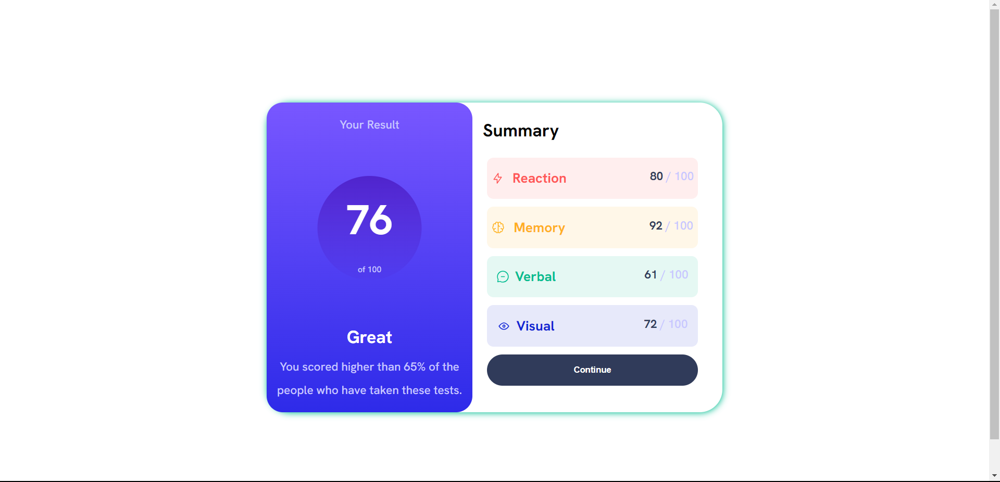

# Frontend Mentor - Results summary component solution

This is a solution to the [Results summary component challenge on Frontend Mentor](https://www.frontendmentor.io/challenges/results-summary-component-CE_K6s0maV). Frontend Mentor challenges help you improve your coding skills by building realistic projects.

## Table of contents

- [Overview](#overview)
  - [The challenge](#the-challenge)
  - [Screenshot](#screenshot)
  - [Links](#links)
- [My process](#my-process)
  - [Built with](#built-with)
  - [What I learned](#what-i-learned)
  - [Continued development](#continued-development)
  - [Useful resources](#useful-resources)
- [Author](#author)

## Overview

### The challenge

Users should be able to:

- View the optimal layout for the interface depending on their device's screen size
- See hover and focus states for all interactive elements on the page
- **Bonus**: Use the local JSON data to dynamically populate the content

### Screenshot




### Links

- Solution URL: (https://github.com/hassanmoaa/Results-Summary-FrontEndMentor.git)
- Live Site URL: (https://marvelous-gumption-4d32c9.netlify.app)

### Built with

[](https://skillicons.dev)

### What I learned

I learned using `clip-path: circle()` to make a circle as provided in the design for the result.

I also refreshed my css skills by doing this project as everyday i'm delighted for a new different challenge! In this case, it was about using flexbox and media-queries in order to create responsive layout.

```
.crcl {
    background: linear-gradient(var(--top-crcl), var(--bottom-crcl));

    clip-path: circle(45px);

    margin: .5rem auto;
    padding: .5rem;
}

.continue-btn:hover:focus {
    cursor: pointer;
    background: linear-gradient(var(--top-bg), var(--bottom-bg));
}

```

### Continued development

- I want to learn more about css by creating multi-page websites

### Useful resources

- (https://developer.mozilla.org/) - MDN helped me with clip-path.
- (https://www.w3schools.com) - W3S helped me with shadow box!

## Author

- Frontend Mentor - [@hassanmoaa](https://www.frontendmentor.io/profile/hassanmoaa)
